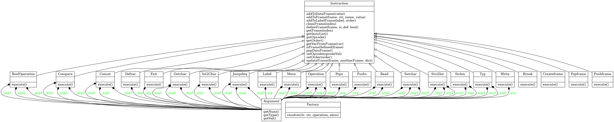

## Implementační dokumentace k 2. úloze do IPP 2022/2023
Jméno a příjmení: Adam Jetmar\
Login: xjetma02

## skript interpret.py
Cílem skriptu interpret.py je, aby interpretoval XML soubor vygenerovaný skriptem `parse.php` obsahujicí kód v jazyce `IPPcode23`. Vstupní soubor je interpretu poskytnut prostřednictvím parametru `--source=file`, kde file značí vstupní soubor obsahujicí kód v jazyce IPPcode23. V případě, že zmiňovaný parametr není skriptu poskytnut, data se načítají ze standardního vstupu. Vstupy pro interpretaci zdrojového kódu jsou interpretu poskytnuty pomocí parametru `--input=file`, kde file je soubor obsahujicí vstupy pro interpretaci. V případě nepřítomnosti tohoto parametru jsou vstupy pro interpretaci načteny ze standardního vstupu. V případě nepřítomnosti obou souborů `--source=file` a `--input=file`, se skript ukončí s chybovou návratovou hodnotou. Je možné si nechat vypsat nápovědu pomocí parametru `--help`. Při výskytu parametru `--help` jsou ignorovány ostatní parametry.
Pro čtení vstupních XML souborů je použitá struktura `xml.etree.ElementTree` a pro načítání parametrů `argparse`.

Třída `Instruction` slouží k ukládání instrukcí. Třída Instruction uchovává název instrukce, pořadí instrukce, rámce a jejich informace a datový zásobník. Pro každou instrukci je implementovaná třída, která dědí z třídy Instruction. V každé třídě jednotlivých instrukcí se nachází metoda `execute(self`, která vykoná interpretaci dané instrukce. Dále se v tříde Instruction nachází standardní metody pro přístup k atributům třídy. Metoda `addToFrame` slouží k úkládání argumentů typu var a jejich hodnot do příslušného rámce podle předaných argumentů. Metoda `getVarFromFrame` naopak řeší jejich získání z rámců.

Třída `Factory` vytváří instanci dané instrukce podle názvu instrukce. Pro argumenty instrukcí je třída `Argument`, která ukládá pořadí argumentu, jeho typ a hodnotu. 

Skokové instrukce jsou implementovány tak, že nejdřív skript načte všechna návěští nacházejicí se v XML souboru. Návěští jsou uloženy do slovníka `labels`. V hlavním cyklu se detekují skokové instrukce a podle jejich argumentů se vyhodnotí, která instrukce se má vykonat následovně. Skokové instrukce `JUMPIFEQ` a `JUMPIFNEQ` mají metodu `execute()`, která vyhodnotí, jestli se má vykonat skok podle návratovej hodnoty této metody (True nebo False).

Diagram tříd:

